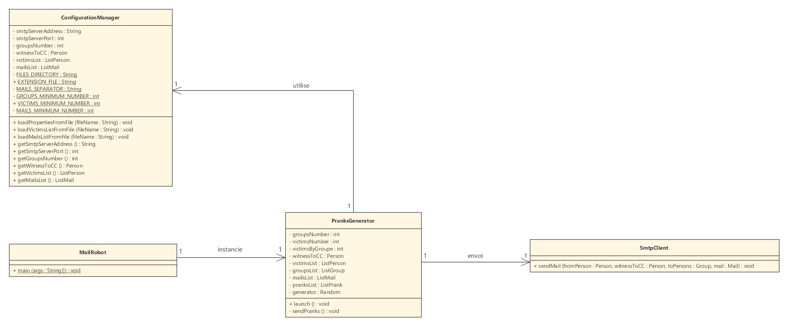
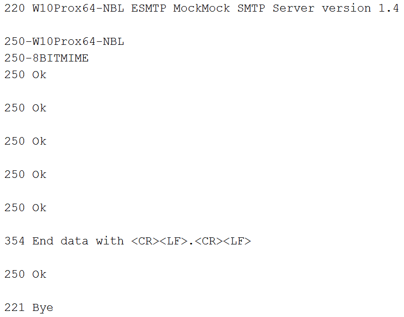
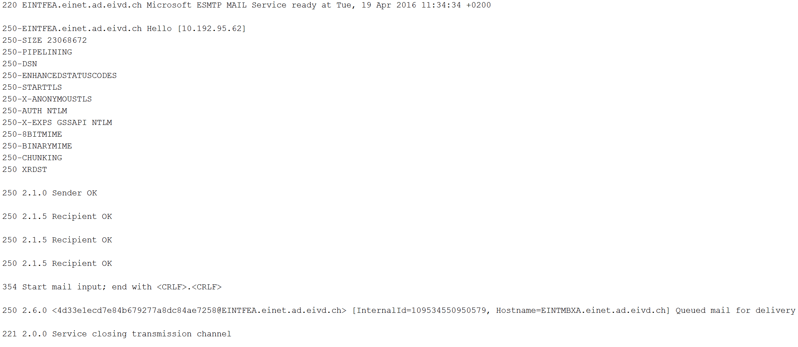

# Teaching-HEIGVD-RES-2016-Labo-SMTP

## Brève description du projet

Ce projet permet d'envoyer des mails de plaisanterie à une liste définie de victimes (adresses mail) depuis des adresses mail qui font partie également de la liste des victimes.
Un nombre de groupes spécifié par l'utilisateur est créé à partir de la liste de victimes. Chacun de ces groupes est constitué d'au moins trois personnes : une personne qui envoie
le mail et les deux autres qui le recoivent. Ces deux personnes qui recoivent le mail auront l'impression que ce dernier provient de la première personne. De plus, celle-ci ne saura pas
que son adresse mail a été utilisée pour envoyer un mail de plaisanterie.  
Pour chaque groupe, un mail est donc envoyé. Son contenu est défini aléatoirement à partir d'une liste de mails écrits par l'utilisateur.  
La communication avec un serveur SMTP (adresse du serveur et numéro de port) est également effectué selon les paramètres définis par l'utilisateur.  
Le code source du projet se trouve dans le répertoire nommé "laboSMTP".

## Instructions pour configuer le projet et lancer une campagne de mails de plaisanterie

Dans le répertoire "laboSMTP", on trouve un dossier nommé "config" qui contient déjà tous les fichiers nécessaires pour exécuter le projet.
Pour pouvoir lancer une campagne, il suffit juste de modifier les trois fichiers contenus dans ce dossier avec ses propres configurations.  
Le fichier "config.properties" permet de définir l'adresse et le numéro de port du serveur SMTP à contacter pour l'envoi des mails. Il permet également de définir le nombre de groupes à créer
à partir de la liste de victimes ainsi que l'adresse mail de la personne qui sera témoin des mails envoyés (mise en copie).  
Le fichier "victims.utf8" permet de définir la liste des adresses mails des victimes qui seront placées dans les différents groupes voulus.  
Il est important de noter que le nombre minimal de victimes est de 3 personnes (adresses mail) par groupe et qu'il faut au moins demander la création d'un groupe pour ne pas avoir d'erreur lors
du lancement du projet et de la campagne.  
Le dernier fichier "mail.utf8" permet simplement de définir le contenu des différents mails qui pourront être envoyés par un groupe. Il faut faire attention à séparer chaque mail par les caractères "=="
(même le dernier) et à ajouter pour la première ligne de chaque mail la balise "Subject: " avec le contenu du sujet du mail correspondant à la suite de cette balise.

Lorsque ces différents fichiers sont correctement remplis, il suffit de lancer le projet en compilant et en exécutant le code source fourni (classes). Normalement, si le serveur SMTP est atteignable, l'envoi
des mails de plaisanterie se fera sans problème. Les réponses du serveur SMTP s'afficheront sur la console. Par contre, si une erreur devait survenir, les informations sur cette erreur (exception) seront également
affichées sur la console pour l'identifier et la corriger rapidement.

## Description de l'implémentation

Ci-dessous, nous retrouvons un diagramme de classe partiel qui se concentre sur les classes les plus importantes du programme.

La classe "MailRobot" est le point d'entrée de ce programme d'envoi de mails de plaisanterie. Cette classe se charge simplement d'instancier un objet de la classe "PranksGenerator" et d'appeler sa méthode "launch". 
La classe "ConfigurationManager" est chargée de récupérer la configuration du serveur SMTP à contacter pour l'envoi des mails, de récupérer la liste des victimes (adresses mail) et de récupérer la liste des mails
(contenu avec sujet). Tout cela en allant lire et "parser" les différents fichiers présentés auparavant. Cette même classe met ensuite à disposition différentes méthodes pour obtenir ces informations récupérées
dans ces fichiers.  
La classe "SmtpClient" est chargée d'envoyer le mail spécifié (contenu et sujet) aux personnes voulus (adresses mail) à partir de la personne choisi en utilisant un objet (de la classe "ConfigurationManager") contenant les
configurations de connexion à un serveur SMTP. Cette objet de configuration est justement défini dans le constructeur de cette classe "SmtpClient".  
La classe "PranksGenerator" va alors instancier un objet de la classe "ConfigurationManager" dans son constructeur pour obtenir les informations nécessaires à l'exécution de la campagne d'envoi. Elle instanciera également
un objet de la classe "SmtpClient" en utilisant l'objet "ConfigurationManager" généré. Ensuite, lorsque sa méthode "launch" est appelée, on crée tout d'abord la liste des groupes en fonction des adresses mail récupérées et après en fonction du
nombre de groupes générés, on choisit aléatoirement pour chaque groupe un mail dans la liste récupérée auparavant et on l'envoie en utilisant l'objet "SmtpClient" avec sa méthode "sendMail". Ainsi, un mail aléatoire sera envoyé pour chaque
groupe avec une personne du groupe comme émetteur et les autres comme récepteurs en utilisant l'objet de la classe "SmtpClient".

Nous présentons maintenant ci-dessous deux exemples de communication (réponses du serveur affichées sur la console) avec deux serveurs SMTP différents définis lors de l'envoi d'un mail.

<i>Exemple avec un serveur SMTP local (utilisation d'un serveur SMTP local mock, voir le chapitre d'après pour des explications d'utilisation).</i>

<i>Exemple avec le serveur SMTP "smtp.heig-vd.ch".</i>

Dans ces deux exemples, la syntaxe de communication est la même. On se connecte d'abord au serveur SMTP avec son adresse et son numéro de port. Le serveur nous répond ensuite avec un message de bienvenue en nous indiquant de quel type il est (système).
Ensuite, nous lui transmettons un message avec le contenu "EHLO res" pour initier l'envoi de mails. Le serveur nous répond qu'il a bien reçu le message avec le code "250". Après, nous lui transmettons différentes commandes à la suite. Nous lui indiquons
l'émetteur du mail, les récepteurs ainsi que la personne mise en copie. Nous utilisons pour cela les commandes `MAIL FROM: exemple@mail.com` (émetteur) et "RCPT TO: exemple@mail.com" (destinataire). Chaque fois que l'on envoie une commande au serveur, il faut
attendre sa réponse. Cette dernière est souvent "Ok" avec le même code "250" (pour indiquer qu'il a bien reçu la commande). Enfin, il faut maintenant utiliser la commande "DATA" et attendre la réponse du serveur comme quoi il est prêt à recevoir le contenu du mail
avec le code "354". Nous lui envoyons alors le contenu du mail et terminons avec un ".". Lorsque le serveur a confirmé la bonne réception des données, on ferme la connexion avec la commande "QUIT". Le serveur nous répond alors qu'il a bien reçu
la commande et fermé la session avec notre client (code "221").

## Instructions pour installer et utiliser un serveur local SMTP mock

Un serveur mock permet de simuler localement sur sa machine de test un serveur de mails SMTP. On peut ainsi faire des essais en local d'envois de mails en utilisant ce serveur SMTP. Il n'est alors pas nécessaire de contacter un "vrai" serveur SMTP (en ligne) et de
risquer de générer du trafique pour rien. A la fin, bien sûr, il sera nécessaire d'utiliser un "vrai" serveur SMTP pour être sûr que son implémentation fonctionne correctement.

Dans ce partage (racine) se trouve un fichier de type "jar" nommé "MockMock.jar". Il s'agit du fichier qui va permettre de lancer un serveur mock en local. Pour installer ce dernier, il suffit simplement de télécharger ce fichier sur sa machine. Ce fichier provient
déjà d'un autre partage sur GitHub qui est disponible ici : [here](https://github.com/tweakers-dev/MockMock). Il est également possible de cloner ce partage (répertoire) sur sa machine avec Git et de lancer la compilation du projet en exécutant 
le fichier "pom.xml" avec Maven (Apache). Cela va créer un projet et il suffira d'aller dans le dossier "target" (généré) pour retrouver le bon fichier "jar" du serveur mock.  
Pour utiliser ce serveur, il faut le lancer (fichier "jar") en ligne de commande (console système) en tapant la commande "java -jar MockMock.jar". Le serveur SMTP se lancera en local et sera à l'écoute sur le port 25 par défaut. L'interface Web permettant d'accéder aux
mails reçus par le serveur SMTP sera accessible depuis le navigateur en tapant l'adresse "localhost:8282" (le port d'écoute pour l'interface Web est le 8282 par défaut). Pour changer les ports d'écoute, il faut utiliser les paramètres "-p" et "-h" en lançant le serveur.  
Maintenant que le serveur SMTP est lancé et qu'on a accès à son interface Web. Il suffit d'envoyer nos mails à l'adresse "localhost" avec le port 25. Ces derniers seront directement visibles dans l'interface Web. Ils ne quitteront bien sûr pas
notre serveur mock vu qu'il s'agit d'un serveur de test.

#### Auteurs

Mathieu Urstein et Sébastien Boson